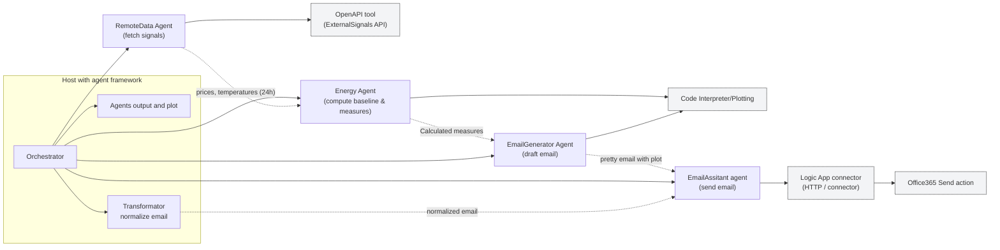
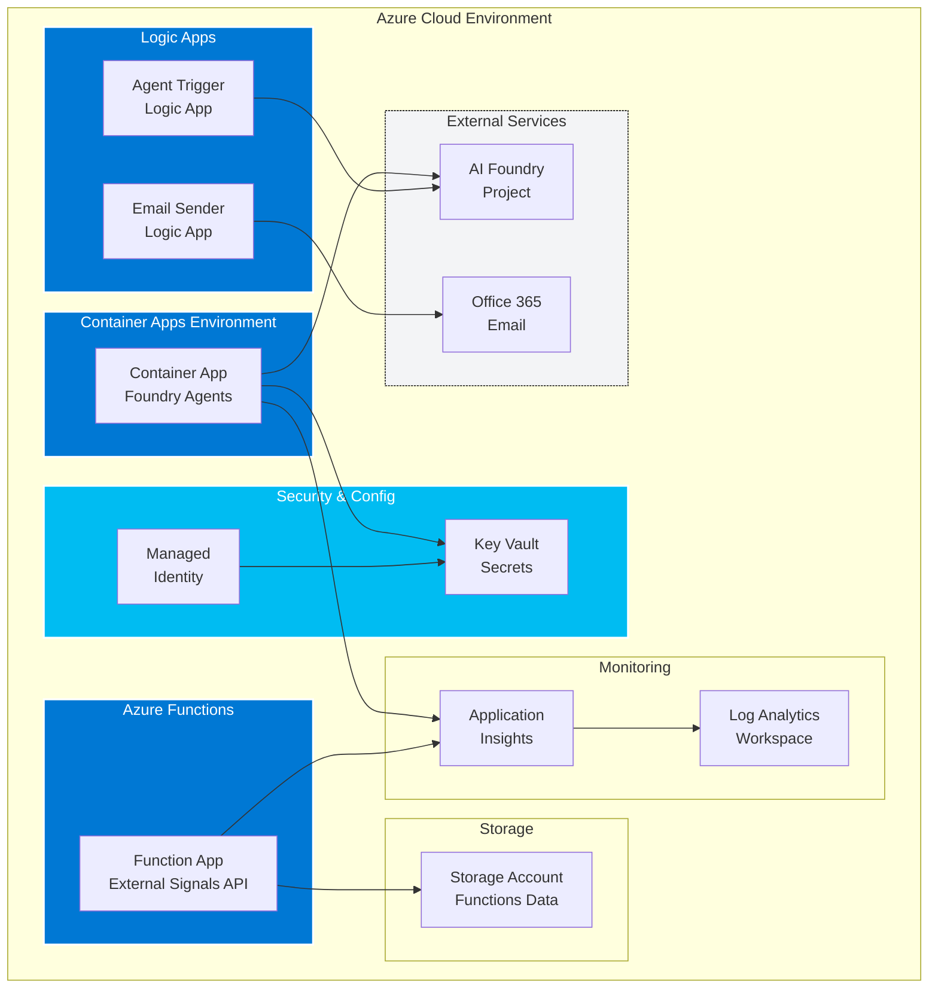

# Foundry Demo — persisted AI agents (C#)

This repository demonstrates persisted AI "agents" hosted in a .NET app with a comprehensive Azure infrastructure for production deployment. It includes a multi-agent orchestration system that runs sequential pipelines and captures outputs, plus complete Infrastructure as Code (Bicep) templates for Azure deployment.

## 📁 What you'll find

### Application Code
- `src/Foundry.Agents` — the host and DI wiring; the console app that builds and runs agents
- `src/Foundry.Agents/Agents` — agent wrappers and the `Orchestrator` implementation
- `src/ExternalSignals.Api` — Azure Functions app providing external data endpoints
- `Agents/` — agent instruction markdown and runtime persisted artifacts (ignored by git)
- `docs/` — orchestrator outputs (e.g. `last_agent_output.json`) and generated plots
- `tests/` — unit tests

### Infrastructure as Code
- `infra/` — Complete Azure infrastructure using Bicep templates
  - `main.bicep` — Production-ready infrastructure with Container Apps
  - `main-dev.bicep` — Development environment with cost-optimized resources
  - `main-complete.bicep` — Full-featured deployment with all components
  - `modules/` — Modular Bicep components (Key Vault, Logic Apps, etc.)
  - `deploy.ps1` — PowerShell deployment script with validation
  - `README.md` — Infrastructure documentation and deployment guide
  - `DEPLOYMENT-SUMMARY.md` — Complete infrastructure overview and costs

High-level behavior
- The host creates-or-fetches persisted agents (RemoteData, Energy, etc.) using the Persistent Agents SDK.
- `Orchestrator` runs a sequential pipeline (RemoteData -> Energy) via an in-process workflow and streams events; the final assembled output is captured in-memory.
- When the Energy output is present, it is pretty-printed to `docs/last_agent_output.json` and a plotting script (Python) is invoked to produce a PNG under `docs/`.

Architecture diagram
The following Mermaid flowchart shows the runtime sequence and handoffs between agents and the Transformator that normalizes generator outputs before the EmailAssistant calls the Logic App connector.



### Azure Infrastructure Architecture



How it works (short)
- Orchestrator runs a sequential pipeline of persisted agents. Agents are created once and reused across runs (agent ids persisted under `Agents/`).
- `RemoteData` returns hourly arrays (24 values) required by `Energy`.
- `Energy` runs a deterministic calculation (via the Code Interpreter snippet in the instructions) and returns a single JSON `GlobalEnvelope` with `data.measures`, `data.baseline`, and `data.optimized`.
- `EmailGenerator` drafts an email and includes inline attachments (small images encoded as base64). It must return plain JSON in a single assistant message per the agent contract.
- `Transformator` normalizes heterogeneous outputs into a canonical envelope (array `email_to`, top-level `email_to_str`, `email_subject`, `email_body_html`, and `attachments`) and enforces inline-only attachments (omits oversized ones and records diagnostics).
- `EmailAssistant` accepts the canonical envelope and calls a deployed Azure Logic App (Office365 connector) to send the email. The Logic App expects a string recipient; the Transformator provides a top-level `email_to_str` to reduce mismatches.

## 🚀 Quick Start

### Option 1: Local Development
1. **Build and run the host locally**:

```powershell
dotnet restore
dotnet build foundry-demo-take4.sln -c Debug

# Configure the persistent agents endpoint and model deployment
$env:PROJECT_ENDPOINT='https://persistent-agents-proj-resource.services.ai.azure.com/api/projects/persistent-agents-proj'
$env:MODEL_DEPLOYMENT_NAME='gpt-4o'
# optional test variables used by examples
$env:TEST_ZONE='SE3'; $env:TEST_CITY='Stockholm'; $env:TEST_DATE='2025-10-01';
$env:TEST_USER_REQUEST="Compute a deterministic baseline and three energy-saving measures for zone SE3 in Stockholm on 2025-10-01. Send the summary by email to you@example.com."

dotnet run --project src/Foundry.Agents --configuration Debug
```

2. **Check outputs**: After a successful run, check `docs/last_agent_output.json` for the energy GlobalEnvelope and `docs/` for any generated plot PNGs.

### Option 2: Deploy to Azure
1. **Deploy infrastructure**:
```powershell
cd infra
# Development environment
.\deploy.ps1 -Environment dev

# Production environment
.\deploy.ps1 -Environment prod -ResourceGroupName "rg-foundry-prod"
```

2. **Configure services**:
   - Set up AI Foundry connector in Logic Apps
   - Authenticate Office 365 connection for email
   - Deploy application code to the provisioned resources

3. **See full deployment guide**: Check `infra/README.md` for comprehensive setup instructions

Troubleshooting tips
- If emails fail to send or recipient fields appear empty in Logic App runs, inspect the orchestrator logs to see the exact normalized JSON the `Transformator` produced (the orchestrator logs the envelope before invoking `EmailAssistant`). Look for `email_to`, `email_to_str`, and `attachments` fields.
- When using Logic Apps, the deployed workflow may need the `isArray(...)` guard when composing the To field. The repo contains a fixed spec under `Tools/OpenApi/logicapp_apispec.json`, but changes must be applied to the live workflow in the Azure Portal or via CI to take effect.
- Large attachments are intentionally omitted by Transformator to enforce inline-only attachments; check the `diagnostics` field in the normalized envelope for omitted items.

Developer notes
- Agent instructions live under `Agents/<Agent>/` (e.g. `Agents/Energy/EnergyInstructions.md`) and define strict single-message JSON contracts. Follow those contracts when adapting or adding agents.
- To add a new agent to the orchestrator sequence, implement the agent instructions file under `Agents/<NewAgent>/` and update `OrchestratorAgent` to include it in the pipeline.

## 🏗️ Azure Infrastructure

The solution includes comprehensive Infrastructure as Code (Bicep) templates for Azure deployment:

### Infrastructure Components
- **Azure Container Apps** - Scalable hosting for Foundry Agents with scale-to-zero capability
- **Azure Functions** - External Signals API endpoints with consumption pricing
- **Azure Key Vault** - Secure storage for secrets and agent configurations  
- **Application Insights** - Centralized monitoring and telemetry
- **Logic Apps** - Agent triggers and email automation workflows
- **Managed Identities** - Secure service-to-service authentication

### Deployment Templates
- **`main.bicep`** - Production infrastructure with enterprise features
- **`main-dev.bicep`** - Cost-optimized development environment
- **`main-complete.bicep`** - Full-featured deployment with all components

### Cost Estimates
- **Development**: ~$8-35/month (Free/Basic tiers)
- **Production**: ~$33-135/month (Scale-to-zero, consumption pricing)

📖 **See `infra/README.md` for complete deployment documentation**

## ⚙️ Configuration

### Application Settings
- `Project:Endpoint` — persistent agents service endpoint
- `Project:ModelDeploymentName` — model deployment id (when creating agents)
- `Azure:KeyVaultName` — Key Vault name for secure configuration (production)
- `Azure:UseManagedIdentity` — enable managed identity authentication (production)

### Environment Variables
- `PROJECT_ENDPOINT` — AI Foundry project API URL
- `MODEL_DEPLOYMENT_NAME` — AI model deployment name
- `AZURE_CLIENT_ID`, `AZURE_CLIENT_SECRET` — Azure authentication (if not using managed identity)

## 📋 Development Notes
- Agent instruction markdown is stored in `Agents/<Agent>/` and is loaded at runtime by the host
- Runtime artifacts (agent ids and temporary run locks) are intentionally ignored by git
- The ExternalSignals.Api provides data endpoints and can be run locally or deployed to Azure Functions
- For production deployment, use the provided Bicep templates for proper Azure resource configuration

## 🧪 Testing

```powershell
# Run unit tests
dotnet test tests/Foundry.Agents.Tests/Foundry.Agents.Tests.csproj -c Debug --no-build

# Infrastructure validation
cd infra
.\deploy.ps1 -Environment dev -WhatIf
```

## 📚 Additional Resources

- **Infrastructure Guide**: `infra/README.md` - Complete Azure deployment documentation
- **Architecture Overview**: `infra/DEPLOYMENT-SUMMARY.md` - Infrastructure components and costs
- **Agent Instructions**: `Agents/*/` - Individual agent configuration and contracts
- **API Documentation**: `src/ExternalSignals.Api/` - External data endpoints
